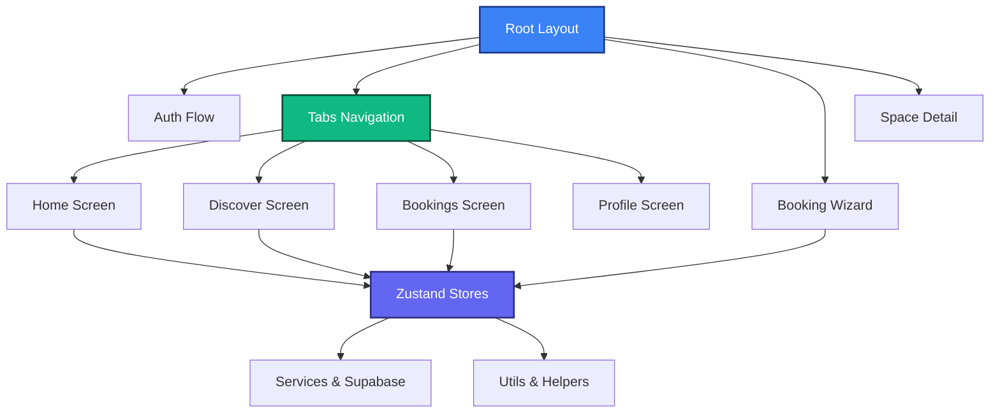

# 🌌 ZYVO Codebase File Summary Directory

Welcome to the **ZYVO** codebase directory summary. ZYVO is a premium, state-of-the-art mobile application designed to simplify booking study spaces, library desks, and private study hubs, built with **React Native**, **Expo SDK 54**, and **Expo Router**.

---

## 🏗️ Architectural Overview

The project is structured around standard modular guidelines for React Native applications utilizing Expo:
*   **Routing & Navigation**: Handled by **Expo Router**, separating authentication `(auth)`, tabbed dashboard navigation `(tabs)`, and specialized flows (`booking/`, `space/`, `session/`, `settings/`, `wallet/`, `notifications/`, `support/`, `rewards/`, `coupons/`, `referral/`, `legal/`, `feedback/`, `invite/`).
*   **Components**: Segregated into `cards` (entity displays), `common` (inputs, buttons, loaders), and custom premium `ui` (chips, occupancy metrics, map sheets).
*   **State Management**: Managed using **Zustand** stores (`authStore`, `bookingStore`, `spaceStore`) enabling lightweight, high-performance state synchronization.
*   **Services & Business Logic**: Separated into services (`auth`, `maps`, `storage`, `supabase`), features containing static mock datasets and typing boundaries, and utils containing helper code.

---

## 💡 Architectural Rationale & Design Decisions

To achieve an Airbnb-like premium standard that remains scalable and performant across platforms (iOS, Android, and Web), the ZYVO codebase adopts several intentional design choices:

### 1. Separation of Routing Layers (`src/app/`)
*   **Authentication Directory `(auth)/`**: Keeps authentication flows fully isolated from core app features. It acts as a logical gate to ensure proper onboarding, location/notification permission requests, and password recovery setups.
*   **Persistent Navigation `(tabs)/`**: Renders a persistent bottom glassmorphism tab bar. It mounts the main tabs on top of a single layout structure to ensure smooth screen transitions without losing the user's navigation context.
*   **Booking Wizard `booking/`**: Rather than grouping booking forms into a single monolithic screen, it splits the sequence into discrete step pages (interactive seat mapping, invoice details, payment selection, cancellation, and rescheduling), preventing high cognitive load and layout clutter.
*   **Active Sessions `session/`**: Isolates trackers for ongoing active sessions. Ticking timers and dynamic extensions are computationally expensive, so isolating them here prevents secondary components from suffering layout recalculation lag.

### 2. State & Component Modularization
*   **Global Stores (`src/store/`)**: Powered by **Zustand**. React Native applications experience visual stuttering if state updates trigger global tree re-renders. Zustand acts as a decoupled state machine where components only subscribe to state slices they care about.
*   **Decoupled UI Components (`src/components/`)**:
    *   `common/`: Reusable primitive inputs and buttons that enforce typography and spacing consistently across the whole app.
    *   `cards/`: Formats raw database entries into interactive UI cards.
    *   `ui/`: Hosts complex animations and overlay sheets.

### 3. Services vs. Utilities
*   **Services (`src/services/`)**: Deal directly with side effects, API boundaries, and device hardware (e.g. database client initialization or local file storage).
*   **Utils (`src/utils/`)**: Consists of purely functional helper utilities. They are context-free, accept standard arguments, and return predictable values, making them extremely reliable and easily testable.

---

## 🗄️ Interactive Codebase Map

### 1. Root & System Configurations

These files contain system requirements, project configuration files, dependency matrices, and environmental variables.

| File Name | Why Use / Description |
| :--- | :--- |
| [`.env`](file:///c:/Users/Lenovo/Desktop/app/zyvo/.env) | Holds environmental variables for Supabase and weather API integrations. |
| [`.gitignore`](file:///c:/Users/Lenovo/Desktop/app/zyvo/.gitignore) | Configures files and directories ignored by Git (e.g. node_modules, .expo). |
| [`app.json`](file:///c:/Users/Lenovo/Desktop/app/zyvo/app.json) | Expo application settings including bundle ID, slug, splash screens, and asset settings. |
| [`expo-env.d.ts`](file:///c:/Users/Lenovo/Desktop/app/zyvo/expo-env.d.ts) | TypeScript ambient type declarations automatically generated by Expo. |
| [`package.json`](file:///c:/Users/Lenovo/Desktop/app/zyvo/package.json) | Lists devDependencies, core dependencies (React 19, Expo SDK 54, Zustand) and run scripts. |
| [`tsconfig.json`](file:///c:/Users/Lenovo/Desktop/app/zyvo/tsconfig.json) | Compiler settings specifying React-JSX compilation, strict checking, and path mappings. |
| [`README.md`](file:///c:/Users/Lenovo/Desktop/app/zyvo/README.md) | The user-facing documentation detailing setup instructions and layout diagrams. |
| [`scripts/bug-checker.js`](file:///c:/Users/Lenovo/Desktop/app/zyvo/scripts/bug-checker.js) | Node utility checking for codebase bugs and structural validation before builds. |

---

### 2. Application Pages & Routes (`src/app/`)

This directory represents the file-system router for ZYVO.

#### 🔑 Authentication Flow (`(auth)/`)
Provides custom onboarding, user registration, profiles, and permission dialogs.

| File Name | Why Use / Description |
| :--- | :--- |
| [`src/app/(auth)/_layout.tsx`](file:///c:/Users/Lenovo/Desktop/app/zyvo/src/app/\(auth\)/_layout.tsx) | Configures standard navigation stack options for user onboarding and registration. |
| [`src/app/(auth)/onboarding.tsx`](file:///c:/Users/Lenovo/Desktop/app/zyvo/src/app/\(auth\)/onboarding.tsx) | Displays user introduction slider detailing the capabilities of ZYVO. |
| [`src/app/(auth)/login.tsx`](file:///c:/Users/Lenovo/Desktop/app/zyvo/src/app/\(auth\)/login.tsx) | Handles user credentials validation and session initialization. |
| [`src/app/(auth)/register.tsx`](file:///c:/Users/Lenovo/Desktop/app/zyvo/src/app/\(auth\)/register.tsx) | Standard account registration form. |
| [`src/app/(auth)/forgot-password.tsx`](file:///c:/Users/Lenovo/Desktop/app/zyvo/src/app/\(auth\)/forgot-password.tsx) | Offers instructions and links for account password recovery. |
| [`src/app/(auth)/create-profile.tsx`](file:///c:/Users/Lenovo/Desktop/app/zyvo/src/app/\(auth\)/create-profile.tsx) | Guided profile details form including university selection and profile photos. |
| [`src/app/(auth)/location-permission.tsx`](file:///c:/Users/Lenovo/Desktop/app/zyvo/src/app/\(auth\)/location-permission.tsx) | Visual prompt requesting device GPS authorization for map coordinates. |
| [`src/app/(auth)/notification-permission.tsx`](file:///c:/Users/Lenovo/Desktop/app/zyvo/src/app/\(auth\)/notification-permission.tsx) | Prompt requesting push notification capability for study session updates. |

#### 📱 Main Tabs (`(tabs)/`)
Core workspace dashboard views containing primary client destinations.

| File Name | Why Use / Description |
| :--- | :--- |
| [`src/app/(tabs)/_layout.tsx`](file:///c:/Users/Lenovo/Desktop/app/zyvo/src/app/\(tabs\)/_layout.tsx) | Renders the bottom Glassmorphic navigation menu with fluid micro-interactions. |
| [`src/app/(tabs)/home.tsx`](file:///c:/Users/Lenovo/Desktop/app/zyvo/src/app/\(tabs\)/home.tsx) | Home screen comprising dynamic greetings, active reservation tracking, and quick options. |
| [`src/app/(tabs)/discover.tsx`](file:///c:/Users/Lenovo/Desktop/app/zyvo/src/app/\(tabs\)/discover.tsx) | Visual map interface showing workspace markers, category selections, and list switches. |
| [`src/app/(tabs)/bookings.tsx`](file:///c:/Users/Lenovo/Desktop/app/zyvo/src/app/\(tabs\)/bookings.tsx) | Tab section listing current, upcoming, completed, and canceled reservations. |
| [`src/app/(tabs)/profile.tsx`](file:///c:/Users/Lenovo/Desktop/app/zyvo/src/app/\(tabs\)/profile.tsx) | Profile stats dashboard showing accumulated hours, verification state, and setting shortcuts. |

#### 🔔 Notifications (`notifications/`)
Alert hub capturing transactional check-ins, timer expirations, and status announcements.

| File Name | Why Use / Description |
| :--- | :--- |
| [`src/app/notifications/index.tsx`](file:///c:/Users/Lenovo/Desktop/app/zyvo/src/app/notifications/index.tsx) | Renders a scrollable list of user notifications, status alerts, and updates. |
| [`src/app/notifications/[id].tsx`](file:///c:/Users/Lenovo/Desktop/app/zyvo/src/app/notifications/\[id\].tsx) | Renders the deep detailed description, dates, and action CTAs of a single notification. |

#### 💳 Wallet System (`wallet/`)
Manages funds, cards, student balances, and payment histories.

| File Name | Why Use / Description |
| :--- | :--- |
| [`src/app/wallet/index.tsx`](file:///c:/Users/Lenovo/Desktop/app/zyvo/src/app/wallet/index.tsx) | Shows active balance, quick top-up packages, and assigned debit methods. |
| [`src/app/wallet/history.tsx`](file:///c:/Users/Lenovo/Desktop/app/zyvo/src/app/wallet/history.tsx) | Displays complete ledger logs showing deposits, booking fees, and refunds. |

#### 🎁 Rewards & Coupons (`rewards/`, `coupons/`, `referral/`)
System workflows boosting retention through points, codes, and invites.

| File Name | Why Use / Description |
| :--- | :--- |
| [`src/app/rewards/index.tsx`](file:///c:/Users/Lenovo/Desktop/app/zyvo/src/app/rewards/index.tsx) | Displays user points balances, progression tiers, and items catalog to redeem. |
| [`src/app/coupons/index.tsx`](file:///c:/Users/Lenovo/Desktop/app/zyvo/src/app/coupons/index.tsx) | Handles entering code strings and lists active percentage/cash discount coupons. |
| [`src/app/referral/index.tsx`](file:///c:/Users/Lenovo/Desktop/app/zyvo/src/app/referral/index.tsx) | Shows invite guidelines, personal sharing codes, and lists earned commission logs. |

#### 🆘 Support Center (`support/`)
Portal coordinating emergency help, documentation, and error ticket forms.

| File Name | Why Use / Description |
| :--- | :--- |
| [`src/app/support/index.tsx`](file:///c:/Users/Lenovo/Desktop/app/zyvo/src/app/support/index.tsx) | Entry help dashboard directing clients to FAQs, bug reports, or live chats. |
| [`src/app/support/faq.tsx`](file:///c:/Users/Lenovo/Desktop/app/zyvo/src/app/support/faq.tsx) | List of accordions explaining guidelines, rules, check-ins, and billings. |
| [`src/app/support/report.tsx`](file:///c:/Users/Lenovo/Desktop/app/zyvo/src/app/support/report.tsx) | Form with detail inputs and attachments to file locks or location faults. |

#### 👤 Profile Management & Settings (`profile/`, `settings/`)
Configurations defining credentials, notification scopes, and privacy rules.

| File Name | Why Use / Description |
| :--- | :--- |
| [`src/app/profile/edit.tsx`](file:///c:/Users/Lenovo/Desktop/app/zyvo/src/app/profile/edit.tsx) | Editable profile details form modifying avatar uploads, names, and emails. |
| [`src/app/settings/account.tsx`](file:///c:/Users/Lenovo/Desktop/app/zyvo/src/app/settings/account.tsx) | Displays student email verification state and anchors deletion workflows. |
| [`src/app/settings/privacy.tsx`](file:///c:/Users/Lenovo/Desktop/app/zyvo/src/app/settings/privacy.tsx) | Toggles controlling profile discovery and background coordinates tracking. |
| [`src/app/settings/notifications.tsx`](file:///c:/Users/Lenovo/Desktop/app/zyvo/src/app/settings/notifications.tsx) | Manages switch parameters for pushes, SMS triggers, and email newsletters. |
| [`src/app/settings/about.tsx`](file:///c:/Users/Lenovo/Desktop/app/zyvo/src/app/settings/about.tsx) | Outlines app versions, software credits, and maps to general policies. |

#### 🎟️ Booking Wizard (`booking/`)
The booking sequence that allows selecting, pricing, and confirming study slots.

| File Name | Why Use / Description |
| :--- | :--- |
| [`src/app/booking/index.tsx`](file:///c:/Users/Lenovo/Desktop/app/zyvo/src/app/booking/index.tsx) | Initializes reservations showing operational schedules, duration guides, and time slots. |
| [`src/app/booking/seats.tsx`](file:///c:/Users/Lenovo/Desktop/app/zyvo/src/app/booking/seats.tsx) | Select interactive seating arrangements with grid maps matching venue designs. |
| [`src/app/booking/summary.tsx`](file:///c:/Users/Lenovo/Desktop/app/zyvo/src/app/booking/summary.tsx) | Confirms reservation inputs, details, and price breakdowns before billing. |
| [`src/app/booking/payment.tsx`](file:///c:/Users/Lenovo/Desktop/app/zyvo/src/app/booking/payment.tsx) | Premium checkout slider displaying card, wallet, and UPI options. |
| [`src/app/booking/success.tsx`](file:///c:/Users/Lenovo/Desktop/app/zyvo/src/app/booking/success.tsx) | **Merged Booking Success + QR Check-in**: Displays the success screen with check-in details, and renders a "Scan QR to Check In" button that launches a simulated scanning modal. |
| [`src/app/booking/cancel.tsx`](file:///c:/Users/Lenovo/Desktop/app/zyvo/src/app/booking/cancel.tsx) | Guided screen showing cancellation costs, refund parameters, and feedback checks. |
| [`src/app/booking/reschedule.tsx`](file:///c:/Users/Lenovo/Desktop/app/zyvo/src/app/booking/reschedule.tsx) | Rescheduling flow allowing slot exchanges and seat mappings modification. |
| [`src/app/booking/[id].tsx`](file:///c:/Users/Lenovo/Desktop/app/zyvo/src/app/booking/\[id\].tsx) | Dynamic route fetching unique receipts, metadata, and status maps. |

#### ⏱️ Sessions & Space Subsystems (`session/`, `space/`)
Real-time study status extensions and specific workspace details modules.

| File Name | Why Use / Description |
| :--- | :--- |
| [`src/app/session/active.tsx`](file:///c:/Users/Lenovo/Desktop/app/zyvo/src/app/session/active.tsx) | Live dashboard displaying ticking remaining timers, extend slot actions, and check out options. |
| [`src/app/session/extend.tsx`](file:///c:/Users/Lenovo/Desktop/app/zyvo/src/app/session/extend.tsx) | Displays stepper selector to query extra duration availability and calculate costs. |
| [`src/app/space/[id].tsx`](file:///c:/Users/Lenovo/Desktop/app/zyvo/src/app/space/\[id\].tsx) | Profile view for individual venues outlining galleries, prices, coordinates, and hours. |
| [`src/app/space/gallery.tsx`](file:///c:/Users/Lenovo/Desktop/app/zyvo/src/app/space/gallery.tsx) | Premium display layout showcasing high-resolution gallery grid cards of the workspace. |
| [`src/app/space/reviews.tsx`](file:///c:/Users/Lenovo/Desktop/app/zyvo/src/app/space/reviews.tsx) | Aggregates all user feedback, scores, rating averages, and detailed reviews lists. |

#### 🔍 Search Sub-system (`search/`)
| File Name | Why Use / Description |
| :--- | :--- |
| [`src/app/search.tsx`](file:///c:/Users/Lenovo/Desktop/app/zyvo/src/app/search.tsx) | Comprehensive filters, history, and search result screen. |
| [`src/app/search/results.tsx`](file:///c:/Users/Lenovo/Desktop/app/zyvo/src/app/search/results.tsx) | Displays results cards, map toggle buttons, and active filter tags. |
| [`src/app/search/filter.tsx`](file:///c:/Users/Lenovo/Desktop/app/zyvo/src/app/search/filter.tsx) | Preferences picker managing price grids, minimum distance markers, and features checkboxes. |

#### 🚨 Error Screens
| File Name | Why Use / Description |
| :--- | :--- |
| [`src/app/404.tsx`](file:///c:/Users/Lenovo/Desktop/app/zyvo/src/app/404.tsx) | Renders fallback illustration views redirecting users back to home screens during invalid URL routes. |
| [`src/app/offline.tsx`](file:///c:/Users/Lenovo/Desktop/app/zyvo/src/app/offline.tsx) | Alerts users of lack of device internet connectivity with reload retry actions. |
| [`src/app/maintenance.tsx`](file:///c:/Users/Lenovo/Desktop/app/zyvo/src/app/maintenance.tsx) | Scheduled system upgrade dashboard indicating ETA logs. |

#### 📜 Legal Regulations & Agreements (`legal/`)
| File Name | Why Use / Description |
| :--- | :--- |
| [`src/app/legal/privacy-policy.tsx`](file:///c:/Users/Lenovo/Desktop/app/zyvo/src/app/legal/privacy-policy.tsx) | Scrollable policy template laying out telemetry data collections rules. |
| [`src/app/legal/terms.tsx`](file:///c:/Users/Lenovo/Desktop/app/zyvo/src/app/legal/terms.tsx) | Outlines terms of service agreement binding users and partner libraries. |
| [`src/app/legal/delete-account.tsx`](file:///c:/Users/Lenovo/Desktop/app/zyvo/src/app/legal/delete-account.tsx) | Safeguard screen outlining penalties and requiring validation before permanent deletion. |

#### 💬 Feedback & Referrals (`feedback/`, `invite/`)
| File Name | Why Use / Description |
| :--- | :--- |
| [`src/app/feedback/index.tsx`](file:///c:/Users/Lenovo/Desktop/app/zyvo/src/app/feedback/index.tsx) | App feedback portal prompting rating scores and features suggestions. |
| [`src/app/invite/index.tsx`](file:///c:/Users/Lenovo/Desktop/app/zyvo/src/app/invite/index.tsx) | Integrates text invitations to device contact list directories. |
| [`src/app/settings/index.tsx`](file:///c:/Users/Lenovo/Desktop/app/zyvo/src/app/settings/index.tsx) | Standard client configuration settings (privacy, system themes, alerts). |
| [`src/app/_layout.tsx`](file:///c:/Users/Lenovo/Desktop/app/zyvo/src/app/_layout.tsx) | Renders global providers (Fonts, status bars) and sets default root routing. |
| [`src/app/index.tsx`](file:///c:/Users/Lenovo/Desktop/app/zyvo/src/app/index.tsx) | Core security gate validating stored tokens to route between auth and app layout. |

---

### 3. Reusable UI Components (`src/components/`)

Contains UI widgets and helper blocks divided by reuse scope.

#### 🎴 Display Cards (`cards/`)
| File Name | Why Use / Description |
| :--- | :--- |
| [`src/components/cards/BookingCard.tsx`](file:///c:/Users/Lenovo/Desktop/app/zyvo/src/components/cards/BookingCard.tsx) | Displays booking cards showing dates, seat numbers, durations, and entry codes. |
| [`src/components/cards/ReviewCard.tsx`](file:///c:/Users/Lenovo/Desktop/app/zyvo/src/components/cards/ReviewCard.tsx) | Displays review cards containing user avatars, ratings, comment text, and tag chips. |
| [`src/components/cards/SpaceCard.tsx`](file:///c:/Users/Lenovo/Desktop/app/zyvo/src/components/cards/SpaceCard.tsx) | Media-rich card component summarizing space availability, ratings, and locations. |

#### 🔨 Common Forms & Loaders (`common/`)
| File Name | Why Use / Description |
| :--- | :--- |
| [`src/components/common/Button.tsx`](file:///c:/Users/Lenovo/Desktop/app/zyvo/src/components/common/Button.tsx) | Premium custom button wrapper providing micro-vibrations, loadings, and gradient overlays. |
| [`src/components/common/Input.tsx`](file:///c:/Users/Lenovo/Desktop/app/zyvo/src/components/common/Input.tsx) | Form text fields displaying validation states, toggleable password masks, and custom icons. |
| [`src/components/common/Loader.tsx`](file:///c:/Users/Lenovo/Desktop/app/zyvo/src/components/common/Loader.tsx) | Custom glassmorphic full-screen loader animation. |
| [`src/components/common/EmptyState.tsx`](file:///c:/Users/Lenovo/Desktop/app/zyvo/src/components/common/EmptyState.tsx) | Standard messaging prompt display used when favorites or booking lists are empty. |
| [`src/components/common/LogoWordmark.tsx`](file:///c:/Users/Lenovo/Desktop/app/zyvo/src/components/common/LogoWordmark.tsx) | Standard ZYVO logo styling. |

#### 💎 Custom UI Elements (`ui/`)
| File Name | Why Use / Description |
| :--- | :--- |
| [`src/components/ui/CategoryChip.tsx`](file:///c:/Users/Lenovo/Desktop/app/zyvo/src/components/ui/CategoryChip.tsx) | Renders selectable horizontal chips representing space types (e.g. Focus Pods). |
| [`src/components/ui/OccupancyBadge.tsx`](file:///c:/Users/Lenovo/Desktop/app/zyvo/src/components/ui/OccupancyBadge.tsx) | Visual indicator displaying current occupancy load using green/amber/red indicator lights. |
| [`src/components/ui/RatingBadge.tsx`](file:///c:/Users/Lenovo/Desktop/app/zyvo/src/components/ui/RatingBadge.tsx) | Compact badge rendering rating scores and reviews counts. |
| [`src/components/ui/SearchBar.tsx`](file:///c:/Users/Lenovo/Desktop/app/zyvo/src/components/ui/SearchBar.tsx) | Input fields responding to filters and launching advanced workspace searches. |
| [`src/components/ui/VenueBottomSheet.tsx`](file:///c:/Users/Lenovo/Desktop/app/zyvo/src/components/ui/VenueBottomSheet.tsx) | Drag-based bottom detail pane showing coordinates, previews, and links from discover maps. |

---

### 4. Global Constants, Themes & Models

Unified variables, styling parameters, and TypeScript structure schemas.

#### 🎨 Styling Theme System
| File Name | Why Use / Description |
| :--- | :--- |
| [`src/constants/colors.ts`](file:///c:/Users/Lenovo/Desktop/app/zyvo/src/constants/colors.ts) | Holds hex palette configurations (`COLORS`) for dark/light variations and status colors. |
| [`src/constants/fonts.ts`](file:///c:/Users/Lenovo/Desktop/app/zyvo/src/constants/fonts.ts) | Registers Outfit/Inter Google Font properties (`FONTS`) and thickness scales. |
| [`src/theme/typography.ts`](file:///c:/Users/Lenovo/Desktop/app/zyvo/src/theme/typography.ts) | Font layouts, line heights, and margins mapping to device viewport scales. |
| [`src/theme/index.ts`](file:///c:/Users/Lenovo/Desktop/app/zyvo/src/theme/index.ts) | Combines typography maps and color schemes into a global `theme` object. |

#### 📂 Global Configuration & Models
| File Name | Why Use / Description |
| :--- | :--- |
| [`src/constants/config.ts`](file:///c:/Users/Lenovo/Desktop/app/zyvo/src/constants/config.ts) | Core application details like API endpoints, mock database options, and defaults. |
| [`src/constants/routes.ts`](file:///c:/Users/Lenovo/Desktop/app/zyvo/src/constants/routes.ts) | Standard enum (`ROUTES`) enforcing path routing strings and parameter layouts. |
| [`src/types/user.ts`](file:///c:/Users/Lenovo/Desktop/app/zyvo/src/types/user.ts) | TypeScript definitions mapping User profiles, session tokens, and achievements. |
| [`src/types/space.ts`](file:///c:/Users/Lenovo/Desktop/app/zyvo/src/types/space.ts) | Typing structure mapping workspace dimensions, capacity rules, galleries, and reviews. |
| [`src/types/booking.ts`](file:///c:/Users/Lenovo/Desktop/app/zyvo/src/types/booking.ts) | Data rules enforcing timeslot durations, checkout tokens, and checkout rates. |
| [`src/types/review.ts`](file:///c:/Users/Lenovo/Desktop/app/zyvo/src/types/review.ts) | Typing structure mapping user rating reports, comment text, and thumbs flags. |

---

### 5. Features, Hooks & State Stores

#### 🧪 Modular Features Data & Types
| File Name | Why Use / Description |
| :--- | :--- |
| [`src/features/auth/types.ts`](file:///c:/Users/Lenovo/Desktop/app/zyvo/src/features/auth/types.ts) | Captures type declarations for signup models. |
| [`src/features/bookings/types.ts`](file:///c:/Users/Lenovo/Desktop/app/zyvo/src/features/bookings/types.ts) | Structures user reservation categories, payment options, and histories. |
| [`src/features/reviews/types.ts`](file:///c:/Users/Lenovo/Desktop/app/zyvo/src/features/reviews/types.ts) | Configures individual rating reviews and category reviews models. |
| [`src/features/spaces/types.ts`](file:///c:/Users/Lenovo/Desktop/app/zyvo/src/features/spaces/types.ts) | Typing structures representing space amenities and map pins. |
| [`src/features/spaces/constants.ts`](file:///c:/Users/Lenovo/Desktop/app/zyvo/src/features/spaces/constants.ts) | Main mock workspace catalog (`MOCK_SPACES`) specifying detail text, pricing, coordinates. |

#### 🪝 React State Hooks
| File Name | Why Use / Description |
| :--- | :--- |
| [`src/hooks/useAuth.ts`](file:///c:/Users/Lenovo/Desktop/app/zyvo/src/hooks/useAuth.ts) | Hook exposing authentication functions (login validation, signup actions). |
| [`src/hooks/useAuthGuard.ts`](file:///c:/Users/Lenovo/Desktop/app/zyvo/src/hooks/useAuthGuard.ts) | Protects routes based on authentication state, handling login redirections. |
| [`src/hooks/useBookings.ts`](file:///c:/Users/Lenovo/Desktop/app/zyvo/src/hooks/useBookings.ts) | Combines booking transactions with state updates. |
| [`src/hooks/useSpaces.ts`](file:///c:/Users/Lenovo/Desktop/app/zyvo/src/hooks/useSpaces.ts) | Hook tracking space lookup actions, categories, and map filter configurations. |

#### 💾 State Management Stores (Zustand)
| File Name | Why Use / Description |
| :--- | :--- |
| [`src/store/authStore.ts`](file:///c:/Users/Lenovo/Desktop/app/zyvo/src/store/authStore.ts) | Manages authentication state. Exports [`useAuthStore`](file:///c:/Users/Lenovo/Desktop/app/zyvo/src/store/authStore.ts#L36-L41) hooks, [`UserProfile`](file:///c:/Users/Lenovo/Desktop/app/zyvo/src/store/authStore.ts#L3-L14) specs. |
| [`src/store/bookingStore.ts`](file:///c:/Users/Lenovo/Desktop/app/zyvo/src/store/bookingStore.ts) | Handles live sessions and histories. Exports [`useBookingStore`](file:///c:/Users/Lenovo/Desktop/app/zyvo/src/store/bookingStore.ts#L187-L266) hooks, [`Booking`](file:///c:/Users/Lenovo/Desktop/app/zyvo/src/store/bookingStore.ts#L18-L47) structures. |
| [`src/store/spaceStore.ts`](file:///c:/Users/Lenovo/Desktop/app/zyvo/src/store/spaceStore.ts) | Holds catalog list options and filters. Exports [`useSpaceStore`](file:///c:/Users/Lenovo/Desktop/app/zyvo/src/store/spaceStore.ts) hook. |

---

### 6. Services & Utilities

External integrations and internal helpers.

#### ⚙️ Services API
| File Name | Why Use / Description |
| :--- | :--- |
| [`src/services/auth.ts`](file:///c:/Users/Lenovo/Desktop/app/zyvo/src/services/auth.ts) | Communicates credentials checks with mockup backends or Supabase tables. |
| [`src/services/maps.ts`](file:///c:/Users/Lenovo/Desktop/app/zyvo/src/services/maps.ts) | Computes distances, handles coordinate permissions, and queries Google Maps API. |
| [`src/services/storage.ts`](file:///c:/Users/Lenovo/Desktop/app/zyvo/src/services/storage.ts) | Persists credentials and local options using React Native AsyncStorage. |
| [`src/services/supabase.ts`](file:///c:/Users/Lenovo/Desktop/app/zyvo/src/services/supabase.ts) | Initializes and exports the connection client configuration [`supabase`](file:///c:/Users/Lenovo/Desktop/app/zyvo/src/services/supabase.ts#L1-L3). |

#### 🛠️ Utility Functions
| File Name | Why Use / Description |
| :--- | :--- |
| [`src/utils/currency.ts`](file:///c:/Users/Lenovo/Desktop/app/zyvo/src/utils/currency.ts) | Formats numeric numbers into localized price strings (`formatCurrency`). |
| [`src/utils/date.ts`](file:///c:/Users/Lenovo/Desktop/app/zyvo/src/utils/date.ts) | Parses slot intervals, formats calendar displays, and logs countdown intervals. |
| [`src/utils/helpers.ts`](file:///c:/Users/Lenovo/Desktop/app/zyvo/src/utils/helpers.ts) | Misc utilities (e.g. debouncing routines, status helpers). |
| [`src/utils/validation.ts`](file:///c:/Users/Lenovo/Desktop/app/zyvo/src/utils/validation.ts) | Enforces field checks. Exports [`isValidEmail`](file:///c:/Users/Lenovo/Desktop/app/zyvo/src/utils/validation.ts#L1-L3) rules. |
